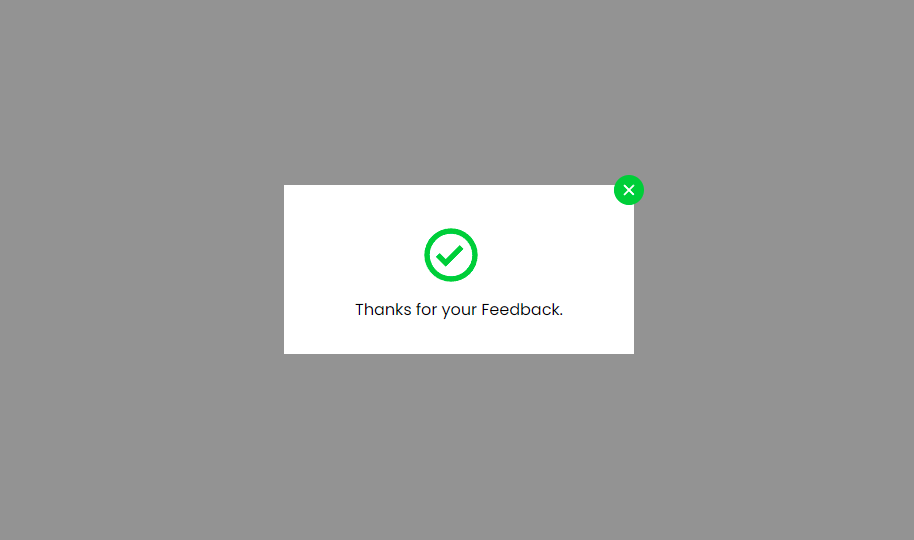

# Simple React Feedback Modal

This is simple react feedback modal for beginner if you have a any suggestion about this work do it.

# Using Technologies
- React js
- React Spring
- React Icons
- React Styled Components
- Vanilla JavaScript
- VS Code Terminal
- Github
- Google Fonts
& many more...

# Required Features
- Open modal by clicking open modal button
- Close modal by clicking keyboard ESCAPE or close button
- With Fancy Style and Animation

# Demo Link

# Demo preview for this project

> Thanks for reach out me on github.